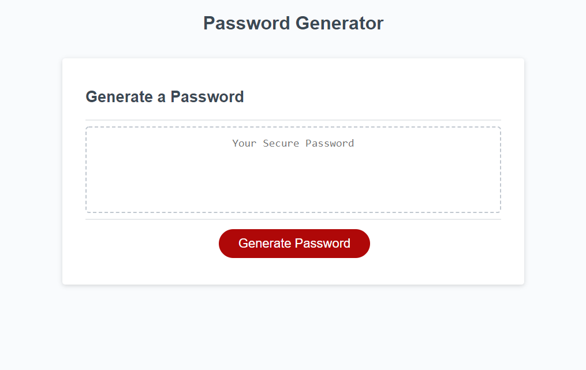

# password-generator
## JavaScript Challenge

## Language used in project to perform tasks: Java Script

## This prodject was intended to make a secure password for the user.

## This project will walk you through a series of prompts inorder to generate a secure password and will also see if your using the accecpted criteria before the generation of the password.

## Links to project: 
### Live URL: https://andreblankholm.github.io/password-generator/ 
### GitHub: https://github.com/AndreBlankholm/password-generator

## License & copyright © Andre Blankholm, U of M Coding Bootcamp